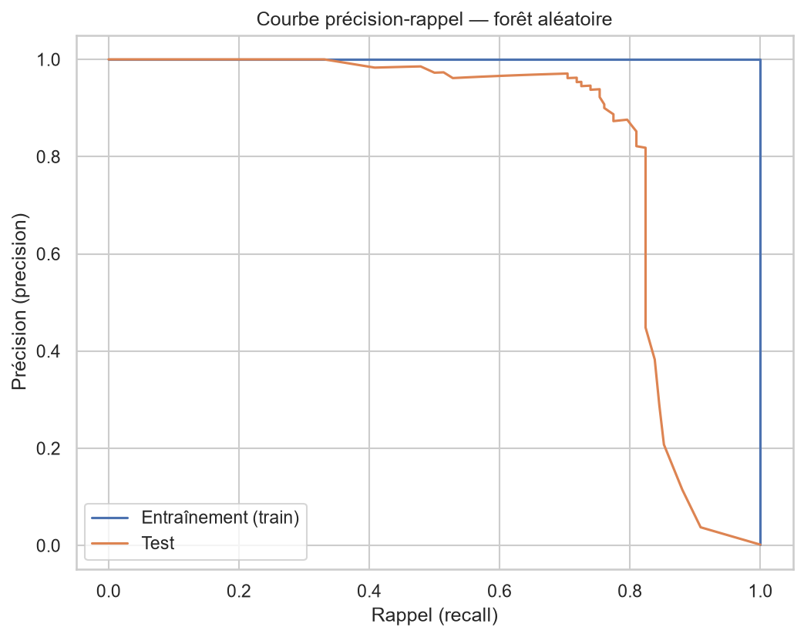

# Détection de fraude bancaire

Détection de transactions frauduleuses par carte bancaire sur un jeu de données 
fortement déséquilibré, via une démarche complète : exploration, préparation, 
modélisation et évaluation rigoureuse.

## Problème

Identifier les transactions frauduleuses parmi ~285 000 opérations par carte 
bancaire. La difficulté centrale est un **déséquilibre extrême** : seulement 
**0,17 % de fraudes** pour 99,83 % de transactions légitimes. Ce déséquilibre 
gouverne toutes les décisions du projet — du choix des métriques à la stratégie 
d'entraînement.

## Données

- **Source** : [Credit Card Fraud Detection (ULB) — Kaggle](https://www.kaggle.com/datasets/mlg-ulb/creditcardfraud)
- **Volume** : 284 807 transactions, dont 492 fraudes
- **Variables** : `Time`, `Amount`, `Class` (0 = légitime, 1 = fraude), et 
  `V1`–`V28` — des composantes anonymisées par PCA (confidentialité bancaire)
- Dataset non versionné (144 Mo). Télécharger `creditcard.csv` et le placer 
  dans `data/raw/`.

## Démarche

**1. Exploration (EDA)**
- Le montant (`Amount`) ne suffit pas à distinguer une fraude : distributions 
  trop recouvrantes entre les deux classes.
- Le signal se concentre dans quelques composantes (V14, V17, V12, V10…).
- Décision de nettoyage clé : **conserver les valeurs extrêmes** — en fraude, 
  l'anomalie est le signal, pas du bruit. Seuls 1081 doublons techniques retirés.

**2. Préparation**
- Séparation train/test **stratifiée** (proportion de fraudes préservée).
- Mise à l'échelle calibrée **sur le train uniquement** → pas de fuite de données.
- Gestion du déséquilibre par **pondération des classes** (`class_weight='balanced'`).

**3. Modélisation & évaluation**
- Comparaison régression logistique (baseline) vs forêt aléatoire.
- Évaluation par précision / rappel / F1 (l'accuracy est trompeuse ici).
- **Validation croisée stratifiée** pour confirmer la stabilité.
- **Réglage du seuil** pour piloter le compromis précision/rappel selon le besoin métier.

## Résultats

| Modèle | Rappel (fraude) | Précision (fraude) | F1 |
|---|---|---|---|
| Régression logistique | 0,89 | 0,05 | 0,10 |
| **Forêt aléatoire** | **0,75** | **0,94** | **0,83** |
| Forêt (seuil ajusté à 0,20) | 0,81 | 0,85 | 0,83 |

Validation croisée (forêt) : **F1 = 0,85 ± 0,03** — performance stable.

Au seuil retenu, le modèle détecte **115 des 142 fraudes** du jeu de test avec 
seulement **20 fausses alertes**.



## Stack technique

Python · pandas · NumPy · scikit-learn · seaborn · matplotlib · JupyterLab

## Structure

​```
fraude-bancaire/
├── data/raw/              # creditcard.csv (non versionné)
├── notebooks/
│   └── 01_eda.ipynb       # exploration, préparation, modélisation
├── reports/
│   └── courbe_precision_rappel.png
├── .gitignore
└── README.md
​```

## Limites & améliorations futures

- **Optimisation des hyperparamètres** (GridSearchCV, ou Optuna pour une recherche 
  bayésienne avancée) — réglages par défaut utilisés ici.
- Test sur des **données plus récentes** pour vérifier la robustesse dans le temps.
- Intégration des **coûts métier réels** (montant moyen d'une fraude, coût d'une 
  alerte) pour optimiser le seuil de façon chiffrée.